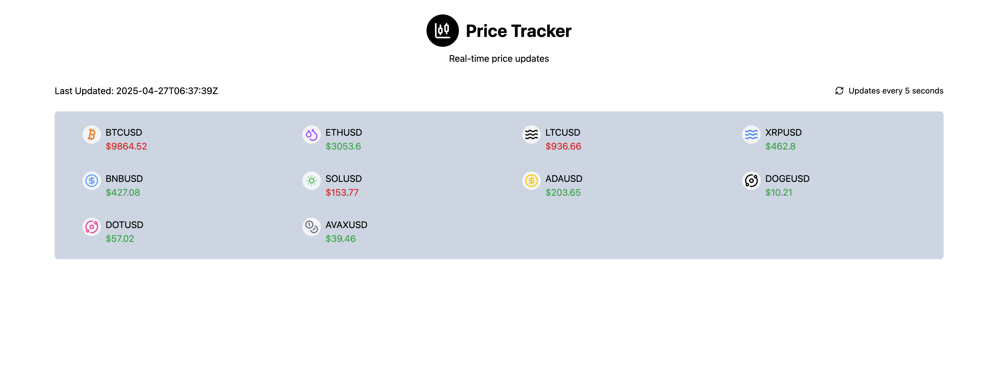

[Read Project Technical Document](https://docs.google.com/document/d/1A7X7TVEKNUqQRa-jc-Is4bqRTHjnsjyg8ZBmHfiHjpk/edit?usp=sharing)

https://github.com/user-attachments/assets/4cd3f9bd-dda1-4c59-b81b-78ca6a355b58

# Project Setup Guide

This project has three parts:
- **Frontend** → Vite + React
- **Backend** → NestJS (Node.js)
- **SignalR Hub** → .NET 8


**Follow these steps to set up and run everything locally.**

---

## 1. Clone the repository

```bash
git clone https://github.com/CodeAddictx10/nestjs-with-signalR.git
cd nestjs-with-signalR
```

---
## 2. SignalR Hub (.NET 8)

**Location**: `signalr/`

### Install .NET SDK

If you don't have .NET installed, install it first:

- Go to [https://dotnet.microsoft.com/download](https://dotnet.microsoft.com/download)
- Download and install the **.NET 8 SDK**.

### Run the SignalR project:

```bash
cd ../signalr
dotnet restore
dotnet run
```
---

## 3. Backend (NestJS)

**Location**: `backend/`

### Install dependencies:

```bash
cd ../backend
yarn install
```
--- 
### Set environment variables:

```bash
cp .env.example .env
```

- Update the `SIGNALR_SERVER_URL` value to the url the signalR is running on
- Set the `REAL_TIME_MODE` value to `signalr`
---

### Run the NestJS server:

```bash
yarn run start:dev
```

The backend API will start, usually at [http://localhost:4444](http://localhost:4444).

---

## 4. Frontend (Vite + React)

**Location**: `frontend/`

### Install dependencies:

```bash
cd frontend
yarn install
```
---
### Set environment variables:

```bash
cp .env.example .env
```

- Update the `VITE_SIGNALR_SERVER_URL` value to the url of the signalR  server
- Update the `VITE_BACKEND_SERVER_URL` value to the url of the backend server
- Set the `REAL_TIME_MODE` value to `signalr`
---

### Run the development server:

```bash
yarn run dev
```

The React app will start, usually at [http://localhost:5173](http://localhost:5173).
---
---
By now, the app should be running successfully, if you navigate to the frontend URL - you should see something like this:
[](./assets/app.png)
---
---
## Common Errors
- CORS Error on the frontend app when connecting to signalR server: This is mostly caused when the frontend url is not included in the origins set in the **signalr/Program.cs on line 12**. Add the frontend url and re run the server again.
- CORS Error on the frontend app when connecting to backend server: This is also caused when the frontend url is not included in the origin set in **server/main.ts on line 8**. Add the frontend url and re run the server again.
---
## Misc.

This application also has a socket.io implementation.

To use socket.io for the real time communication, kindly follow this step

### 1. Backend Server (Nestjs)
- Update the `REAL_TIME_MODE` value to `socketio` and restart the server

 ### 2. Frontend (React App)
- Update the `REAL_TIME_MODE` value to `socketio` and restart the server
- Refresh the browser for the update to take effect
---

  

